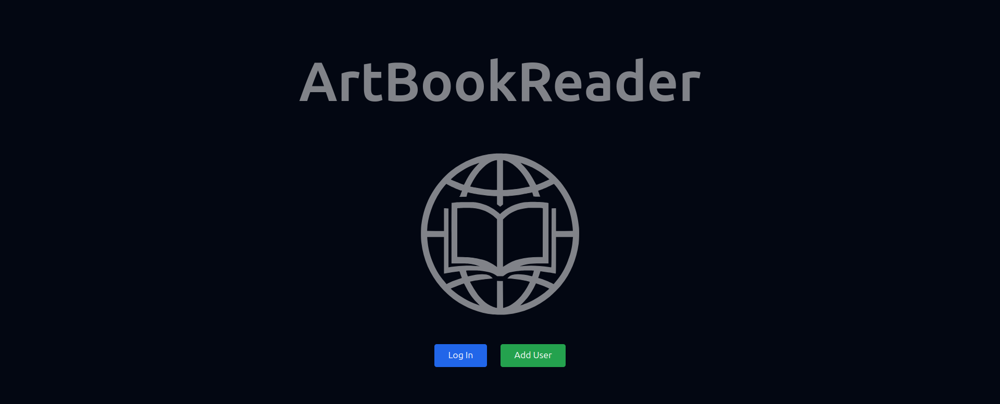
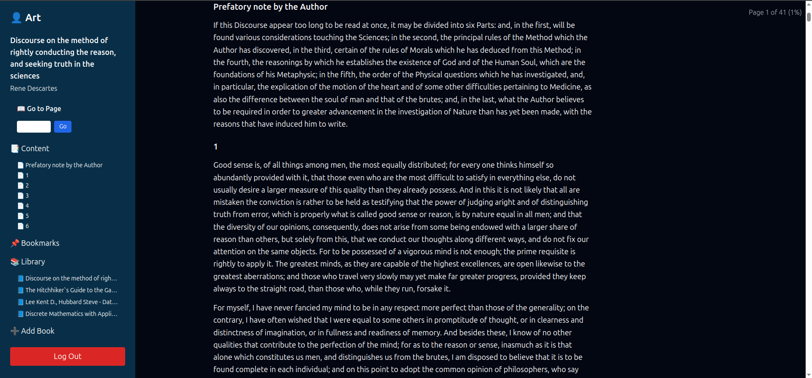

# ArtBookReader 📖🌐

**ArtBookReader** is a web application for reading and organizing books in multiple formats. It supports `.txt`, `.fb2`, `.pdf`, and `.djvu` files, providing a smooth reading experience with personalized bookmarks and automatic reading position tracking.

---

## 🚀 Features

- 📂 Upload and read books in `.txt`, `.fb2`, `.pdf`, `.djvu` from local storage
- 🔖 Add bookmarks with optional notes
- 🧠 Automatically save and restore reading position
- 📑 View book structure and navigate by chapters
- 🔐 User authentication and personal libraries
- 🌓 Dark mode interface

---

## ⚙️ Tech Stack

- **Backend:** Django, Django REST Framework, PostgreSQL
- **Frontend:** React (Vite), TailwindCSS
- **Book parsing:** fb2 & pdf metadata extractors, djvu.js client-side rendering
- **Deployment:** Docker & docker-compose

---

## 🛠️ Installation

> This project is fully containerized using **Docker** and **docker-compose**.

### Clone the repository

```bash
git clone https://github.com/Art21042147/ArtBookReader
cd artbookreader
```
### 🐳 Docker (All-in-One)

This project is production-ready and packaged as a **single Docker container** that includes:

- Django backend
- Prebuilt React frontend (Vite)
- PostgreSQL connection support
- Static and media file handling

### 📄 Environment Variables

Create a `.env` file in the root directory based on `.env.example`:

```env
DEBUG=1
DJANGO_SECRET_KEY=your-secret-key
POSTGRES_DB=db_name
POSTGRES_USER=db_user_name
POSTGRES_PASSWORD=db_user_password
DATABASE_URL=postgres://db_user_name:db_user_password@db:5432/db_name
```
### 🔧 Build and run locally

The application will be available at:
```bash
http://localhost:8000
```

Make sure you have Docker and Docker Compose installed. Then run:
```bash
docker-compose up --build
```

### ⚙️ Commands
Create a Django superuser inside the running container:
```bash
docker-compose exec web python manage.py createsuperuser
```
Apply migrations manually (optional):
```commandline
docker-compose exec web python manage.py migrate
```

## Project Structure

```
ArtBookReader/
├── backend/        # Django backend with REST API
│   ├── core/       # App logic: models, views, serializers
│   └── static/     # Static files (e.g., logo.svg)
├── frontend/       # React (Vite) frontend
│   └── public/     # Public assets
├── media/          # Uploaded book files
├── templates/      # Django templates (index.html)
```

## Screenshots

### Main Page
Just add a user or sign in with an existing one and enjoy reading.



---

### Reading Page
Left click on the space will show a sidebar with an intuitive user interface. Here you will see the name specified during registration, you can add a book to the library and use navigation.



---

## Authors

* **Arthur Ilin** - *Core development and implementation* - [Art21042147](https://github.com/Art21042147)
